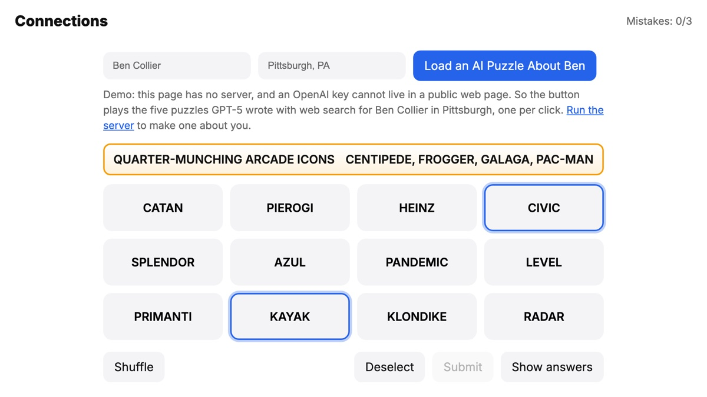

# Connections About You

**Play the demo:** https://bcollier.github.io/connections_demo/

A Connections-style word game in the style of the NYT puzzle, where an AI writes the four groups about the player. Type a name and a town, and a small Node server asks GPT-5, with web search, for four groups of four words drawn from that person's public footprint, their city, and some playful guesses about their tastes. Find the four groups with no more than three mistakes. When the game ends, the page shows why each group was chosen and links to what the AI read.

<p align="center"></p>

## The GitHub Pages demo

GitHub Pages only serves static files, and an OpenAI key cannot live in a public web page: anything the browser can read, a visitor can read. So the demo has no live generation. Its button plays the five puzzles GPT-5 wrote for "Ben Collier, Pittsburgh, PA" on September 29, 2025, one per click, saved from the server's history in [`demo/puzzles.js`](demo/puzzles.js). Everything else is the real game: selection, mistakes, the colored groups, the per-group notes, the closing explanation, and the links.

[`viewer.html`](https://bcollier.github.io/connections_demo/viewer.html) lists the same saved puzzles side by side.

## Run it with live AI generation

1. Install dependencies and add an OpenAI key:

   ```bash
   npm install
   cp .env.example .env
   # edit .env and set OPENAI_API_KEY
   ```

2. Start the server (port 3000):

   ```bash
   npm start
   ```

3. Open `index.html` from disk, or serve the folder (`python3 -m http.server 8000`) and open http://localhost:8000. On `localhost` or a file the page calls `http://localhost:3000` automatically. Enter a name and a location and press **Generate a Puzzle About Me!** A puzzle takes one to three minutes because the model searches the web first.

If the server is not running, the page says so and plays a saved puzzle instead. To point a hosted copy at a server you deploy yourself, set `window.CONNECTIONS_API_BASE` in [`config.js`](config.js).

## How a puzzle is made

`server/index.js` builds one prompt and calls the OpenAI Responses API with the `web_search` tool.

- **Rules for the groups.** At least two groups are about fun things (food, games, music, nostalgia), at most one is about work, and at most one is about the place. Sixteen unique words, family friendly, public information only.
- **Examples of good groups.** The prompt includes real NYT Connections groups from [`nyt_connections_groups_history_sept2025.csv`](nyt_connections_groups_history_sept2025.csv) to show the format and the difficulty ladder (yellow easiest, then green, blue, and purple for wordplay).
- **Memory between players.** The labels of the last 20 puzzles in `data/history.jsonl` go into the prompt with a request not to repeat them.
- **Checks.** The reply is parsed out of the model text, validated with a zod schema, and normalized. If any word repeats across groups, it asks again, up to two retries. Missing per-group explanations are filled by a second, cheaper call.
- **Fallback.** If generation fails, the server returns a fixed puzzle instead of an error.

Every request and model reply is appended to `logs/app.log`, and every finished puzzle to `data/history.jsonl`. The log is git-ignored; it holds the full prompts and model output.

## Files

| Path | What it is |
| --- | --- |
| `index.html`, `styles.css`, `script.js` | The game. No build step and no libraries. |
| `config.js` | Where the generator runs. Empty means demo mode. |
| `demo/puzzles.js` | The saved GPT-5 puzzles the demo plays. |
| `viewer.html` | Lists generated puzzles, from the server's history or the saved ones. |
| `server/index.js` | Express server: `POST /api/generate`, `GET /api/history`, `GET /api/ping`, `POST /api/client-log`. |
| `data/history.jsonl` | Every puzzle the server has generated. |
| `nyt_connections_groups_*.csv` | Example groups used in the prompt. |

## Gameplay

- Select four tiles and press **Submit**.
- A correct set locks in at the top, tinted with its difficulty color. A wrong one costs a mistake; three mistakes end the game and reveal the rest.
- **Shuffle** reorders the tiles, **Deselect** clears your picks, **Show answers** lists every group, and **Reset Game** replays the current puzzle.
- Each solved group sets off confetti, bigger every time, and solving all four sets off fireworks. The animations are plain CSS and JavaScript.

To change the starting puzzle, edit `DEFAULT_PUZZLE` in `script.js`: four categories of four distinct words, each with a color.
