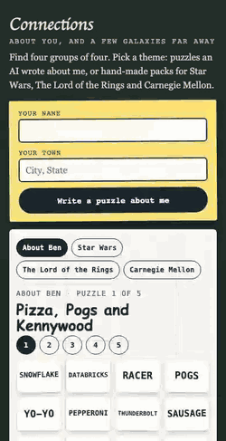
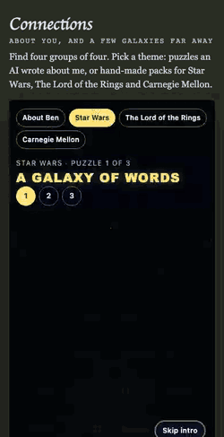
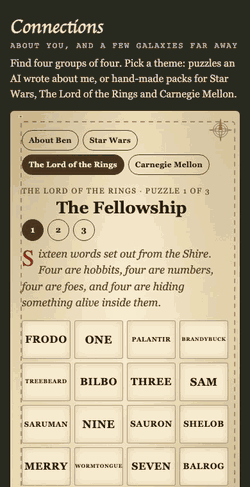
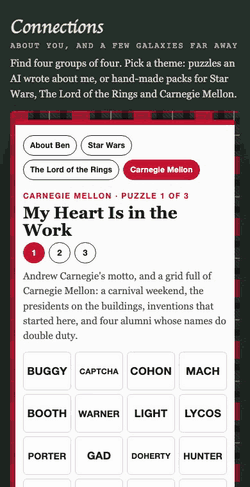
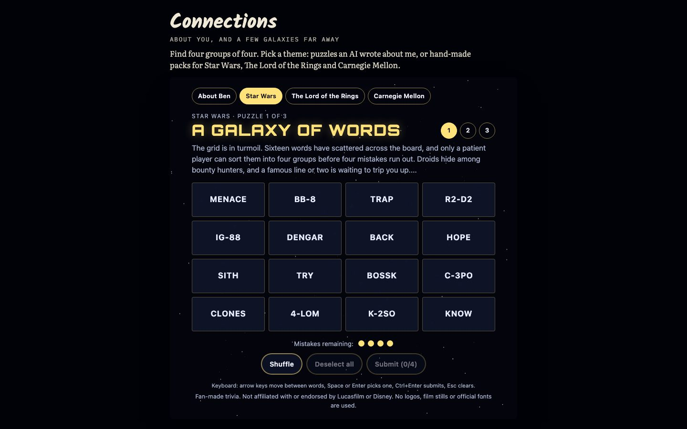
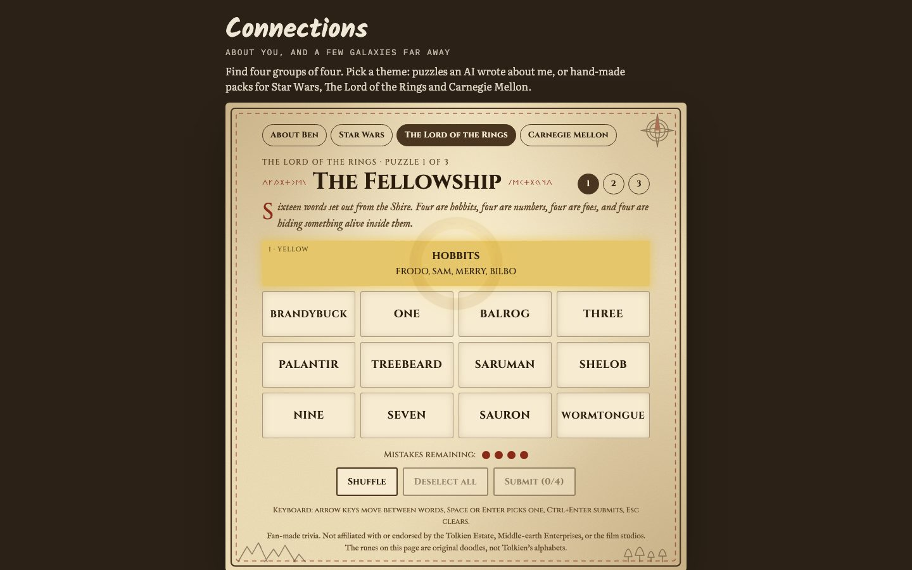
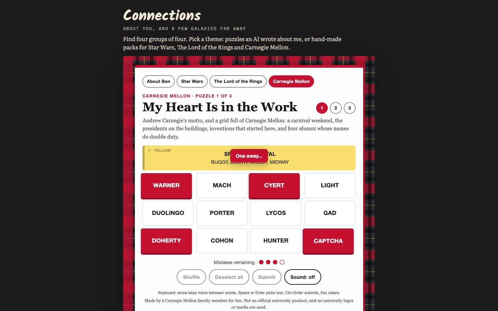
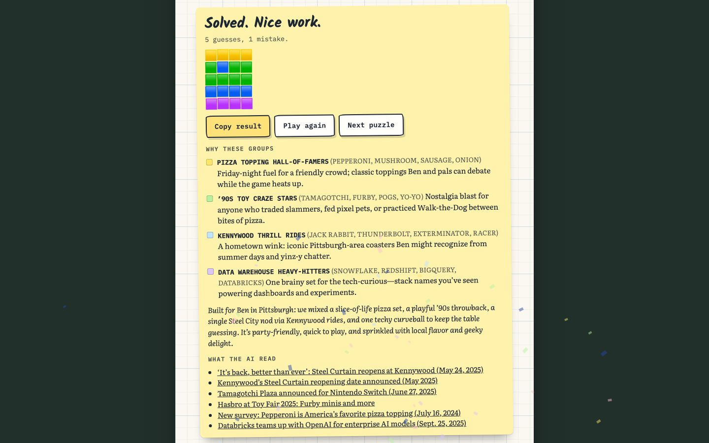

# Connections About You

A word game in the style of the New York Times' Connections, with two kinds of puzzles: ones an AI writes about you from a web search, and hand-made packs for Star Wars, The Lord of the Rings and Carnegie Mellon. Each pack plays in its own animated theme.

**Play:**

- https://bcollier.github.io/connections_demo/ : every pack, no server (the About Ben pack is five puzzles the AI wrote about me).
- https://ben.collier.phd/connections/ : the same game inside my site.
- https://connections-about-you.vercel.app : the live version, where the AI writes a new puzzle about whoever types their name. It only does that while a model key is set in the Vercel project; without one it says so and plays a saved puzzle.

Deep links pick a theme and puzzle: `?theme=starwars&puzzle=2` (themes are `ben`, `starwars`, `lotr`, `cmu`).

| About Ben | Star Wars | The Lord of the Rings | Carnegie Mellon |
| --- | --- | --- | --- |
|  |  |  |  |

## Contents

- [What it is and why](#what-it-is-and-why)
- [How to play](#how-to-play)
- [The themes](#the-themes)
- [How a live puzzle is made](#how-a-live-puzzle-is-made)
- [Architecture](#architecture)
- [Data formats](#data-formats)
- [Themed packs, and how to add one](#themed-packs-and-how-to-add-one)
- [Animation and accessibility](#animation-and-accessibility)
- [Running it locally](#running-it-locally)
- [Deploying](#deploying)
- [Costs](#costs)
- [Privacy: what is and isn't published](#privacy-what-is-and-isnt-published)
- [Testing](#testing)
- [Limitations](#limitations)
- [Notes: using an LLM as a game engine](#notes-using-an-llm-as-a-game-engine)
- [Files](#files)
- [Credits](#credits)

## What it is and why

Connections gives you sixteen words and asks you to sort them into four groups of four. The groups get harder from yellow to purple, and the fun is in the red herrings: words that look like they belong to one group but are needed in another.

I built this for a class on coding with AI, to answer a question my students kept asking: can a language model be the part of a game that makes the content, and not just the part that chats? A Connections puzzle is a good test. It is small (sixteen words), it has hard rules a program can check (four groups, four words each, no repeats), and it has soft rules only a person can judge (is it fair, is it fun, is the purple group clever or just obscure). So the AI writes puzzles about the player, and the code checks everything it can.

The themed packs came later, for the opposite reason. I wrote them by hand to see how much work a good puzzle takes, and to give the game something to play that doesn't need a server or a name.

## How to play

- Click (or tap) four words you think belong together, then **Submit**.
- A right guess slides the four words to the top as a colored band with the group's name. Yellow is the easiest group and purple the hardest.
- A wrong guess costs one of four mistakes (the dots). If three of your four words belong together, the game says **One away...**. Guessing the same four twice costs nothing.
- **Shuffle** moves the words around, which helps more than you'd think. **Deselect all** clears your picks.
- When you finish, the game explains every group and the trap in the puzzle, and **Copy result** puts your guesses on the clipboard as colored squares, like the NYT's share grid.

Keyboard: arrow keys move between words, Space or Enter picks one, Ctrl+Enter (Cmd+Enter on a Mac) submits, Esc clears the picks.

## The themes

Each theme is a skin over the same game: the rules, controls and layout don't change. Everything is drawn with CSS, inline SVG and canvas. There are no logos, film stills, official fonts or trademarked artwork; the themes evoke their worlds with original shapes and colors.

| Theme | Look | When you solve a group | When you win |
| --- | --- | --- | --- |
| **About Ben** | Graph paper, tilted index-card tiles, the handwriting and mono fonts from my site. | A highlighter swipes across the band. | Paper confetti in highlighter colors. |
| **Star Wars** | Deep space, a canvas starfield drifting toward you, gold type. Each puzzle opens with an original crawl that scrolls up a tilted plane (skip it with the button or Esc). | The stars stretch into hyperspace streaks; the band ignites from left to right like a blade. | A longer jump to lightspeed, a small screen rumble, star-shaped sparks. |
| **The Lord of the Rings** | Parchment with darkened edges, a map border that inks itself in with a dashed route inside it, a compass rose, mountains and trees, and rune-like flourishes beside the title. The runes are invented strokes, not Tolkien's alphabets. | A golden ring rises over the band and glows. | A larger ring and falling golden leaves. |
| **Carnegie Mellon** | A tartan drawn in CSS gradients (Carnegie red, iron gray, black and a gold thread), a white card with a red top rule. | Music notes float up from the band. | A bagpipe marches across the bottom, squeezing its bag, with tartan confetti. |

Sound is off by default everywhere. Only the Carnegie Mellon theme has any: a **Sound: off** button that, once you turn it on, plays a short synthesized drone and chanter tune (Web Audio, an original tune in A mixolydian). Browsers only allow sound after a click, and this needs that click.

### The puzzles

| Pack | Puzzles |
| --- | --- |
| About Ben (written by GPT-5, saved) | Pizza, Pogs and Kennywood · Arcade Night · The Experiment · The Data Stack · Model Behavior |
| Star Wars | A Galaxy of Words · The Saber Test · Outer Rim Run |
| The Lord of the Rings | The Fellowship · Second Breakfast · A Long Walk to Mordor |
| Carnegie Mellon | My Heart Is in the Work · Tartan Pride · Carnival Weekend |

The hand-made puzzles follow the NYT pattern: a plain yellow group, a purple group built on wordplay, and at least one red herring that crosses groups (six tiles look like droids, but two of them are also bounty hunters, and only four bounty hunters are on the board). The facts were checked against fan wikis (Wookieepedia, Tolkien Gateway) and Carnegie Mellon's own pages, and nothing spoils more than the films' and books' well-known plots.

## How a live puzzle is made

`server/generator.js` builds one prompt, calls the model, and checks the answer. The same code runs in the local Express server and the Vercel function.

```mermaid
sequenceDiagram
  participant P as Player's browser
  participant S as Server (Express or Vercel)
  participant W as Web search (Tavily or OpenAI tool)
  participant M as Model (gpt-oss-120b or GPT-5)
  P->>S: POST /api/generate {name, town}
  S->>S: limits: origin, per-visitor rate, in-flight cap
  S->>W: three searches (the player, their interests, their town)
  W-->>S: numbered sources
  S->>M: prompt = rules + example NYT groups + sources + last 20 puzzles' themes
  M-->>S: JSON text
  S->>S: parse, schema check, 16 unique words
  alt a check fails
    S->>M: same prompt + "your last answer broke the rules" (up to 2 retries)
  end
  S->>M: (only if reasons are missing) a short second call for per-group explanations
  S-->>P: puzzle JSON
  P->>P: play it; on any error, play a saved puzzle instead
```

**The prompt.** It reads like a brief to a puzzle editor, in five parts:

1. *Tone.* A party game, playful and family friendly. It may guess at hobbies and tastes, as long as the guesses are friendly and not sensitive.
2. *The rules that keep it a game, not a resume.* At least two groups about fun things (food, games, music, nostalgia), at most one about work, at most one about the place. Sixteen different words, all single game tokens. Public information only.
3. *Examples.* Twelve real NYT Connections groups from [`nyt_connections_groups_history_sept2025.csv`](nyt_connections_groups_history_sept2025.csv), to show the format and how hard each color should be.
4. *The color rubric.* Yellow straightforward, green specific, blue lateral, purple wordplay or puns.
5. *The output contract.* A JSON shape with a label, four words, a reason and a color per group, a paragraph on why the puzzle suits the player, and three to six links.

**Web search.** With OpenAI, the model uses its own `web_search` tool. The free route, gpt-oss-120b on Jetstream2, can't search, so the server runs three [Tavily](https://tavily.com/) searches first and pastes the results in as a numbered source list, with an instruction to take facts and links only from that list. If nothing turns up, the prompt says so and asks for a puzzle built from the town and friendly guesses, with no links.

**Validation and retries.** The model's text goes through `extractJsonCandidate` (plain JSON, a fenced block, or the first `{` to the last `}`), then the zod schema in `server/validate.js` (four groups, four words each, labels up to 40 characters, words up to 20). Words are normalized for display (upper case, letters, digits, spaces, hyphens, apostrophes), colors are mapped to the four names, and then the check that matters most: sixteen *unique* words, compared with punctuation stripped, so `R2-D2` and `R2 D2` count as the same word. Any failure triggers a retry with a note about what went wrong, up to two retries. If the groups come back without reasons, a second, cheaper call writes them.

**The last-20 memory.** Left alone, the model reaches for the same themes over and over (pierogies, the Steelers, Python libraries). So the labels of the last twenty puzzles go back into the prompt with a request not to repeat them. Locally they come from `data/history.jsonl`. On Vercel, where nothing is written to disk, the memory starts from the saved Ben puzzles and grows in memory until the instance restarts.

**Fallbacks.** Every failure path ends in a playable puzzle: the local server returns a fixed puzzle, the Vercel function returns an error with a friendly message, and the page then plays one of the saved About Ben puzzles and shows that message.

## Architecture

```mermaid
flowchart LR
  subgraph Browser
    I[index.html + script.js<br/>page shell, theme picker, the live form]
    PL[player/player.js + player.css<br/>game, themes, animation]
    PK[packs/packs.js<br/>all packs as one script]
    I --> PL
    PK --> PL
  end
  subgraph Repo
    J[packs/*.json] -->|scripts/build-packs.mjs<br/>validate + bundle| PK
    V[server/validate.js]
    V --> J
  end
  subgraph Servers
    E[server/index.js<br/>local Express :3000]
    F[api/generate.js<br/>Vercel function]
    G[server/generator.js<br/>prompt, model call, retries]
    E --> G
    F --> G
    G --> V
  end
  I -->|POST /api/generate| E
  I -->|POST /api/generate| F
  G --> T[(Tavily search)]
  G --> X[(Jetstream2 gpt-oss-120b<br/>or OpenAI GPT-5)]
  subgraph Site[ben.collier.phd]
    C[connections/index.html<br/>site header, sticky-note theme picker]
    CP[js/connections/ copy of player + packs]
    C --> CP
  end
  PL -. scripts/sync_connections.sh .-> CP
```

Three places run the same player:

| Where | Puzzles | Server |
| --- | --- | --- |
| GitHub Pages (`bcollier.github.io/connections_demo`) | All four packs | None. The About Ben form is replaced by a note. |
| Vercel (`connections-about-you.vercel.app`) | All four packs, plus a new puzzle about you | `api/generate.js` |
| ben.collier.phd/connections/ | All four packs | None |

The site keeps a copy of `player/player.js`, `player/player.css` and `packs/packs.js` that its `scripts/sync_connections.sh` pulls from this repo, so there is one source of truth (here) and the site is still plain static files in its own style. I chose a synced copy over an iframe because the game then sits in the page itself: it sizes to its content with no scroll-inside-a-scroll, it uses the site's fonts, keyboard focus moves naturally from the page into the game, and the site keeps working if this repo's Pages site is down.

## Data formats

### A puzzle

The same shape comes back from the live generator and sits in every pack. Fields marked *pack* are required only in hand-curated packs.

```jsonc
{
  "id": "sw-1",                       // pack: unique across all packs
  "title": "A Galaxy of Words",       // pack
  "intro": "The grid is in turmoil...", // optional; the Star Wars crawl uses it
  "explanation": "Six tiles look like droid designations, but...", // why the traps work, shown at the end
  "categories": [                     // exactly 4
    {
      "label": "DROIDS",              // 1 to 40 characters
      "words": ["R2-D2", "C-3PO", "BB-8", "K-2SO"], // exactly 4, each 1 to 20 characters
      "explanation": "The astromech, the protocol droid...", // up to 240 characters; pack: required
      "color": "Yellow"               // Yellow | Green | Blue | Purple; pack: each exactly once
    }
  ],
  "recommendations": [                // optional, up to 6; live puzzles only
    { "title": "...", "url": "https://...", "type": "article" }
  ]
}
```

Rules the validator enforces (`server/validate.js`, `puzzleProblems`):

- four groups of exactly four words;
- sixteen different words after stripping everything but letters and digits;
- four different labels;
- in strict mode (packs): all four colors once each, an explanation for every group, and words already in display form (upper case).

### A pack

```jsonc
{
  "id": "starwars",            // also the ?theme= value
  "name": "Star Wars",         // shown in the picker
  "theme": "starwars",         // which skin: ben | starwars | lotr | cmu
  "blurb": "Droids, bounty hunters...",
  "disclaimer": "Fan-made trivia. Not affiliated with...", // shown under the game
  "puzzles": [ /* three or more puzzles */ ]
}
```

The About Ben puzzles also carry `generated: { model, ts, player, location }`, saying which model wrote them and when.

## Themed packs, and how to add one

The packs are plain JSON in `packs/`. `scripts/build-packs.mjs` validates all of them and writes `packs/packs.js`, which the pages load with a `<script>` tag rather than `fetch`, so the game also works when you open `index.html` straight from disk.

To add a puzzle to an existing pack: add it to the pack's `puzzles` array, run `npm run packs`, and play it.

To add a pack with an existing skin, set its `theme` to one of the four skins. To add a new skin:

1. Write `packs/<id>.json` with `"theme": "<id>"`, and add the id to `PACK_ORDER` and `THEMES` in `scripts/build-packs.mjs`.
2. In `player/player.css`, add a `.cx[data-theme="<id>"]` block. Most of a skin is custom properties: background, tile, selection and button colors, the four group colors (`--cx-y`, `--cx-g`, `--cx-b`, `--cx-p`), fonts, corner radius, and `--cx-cw`, the average capital width of the tile font, which the tiles use to shrink long words onto one line.
3. In `player/player.js`, add an entry to `THEMES` (end-of-game lines and the confetti's colors and shape). For decoration, `applyTheme()` adds SVG to the decoration layer, and `themeSolve()` and `finish()` hold the per-group and win effects.
4. Run `npm test` and `npm run test:e2e`, then look at the new screenshots.

Writing a good puzzle by hand, in my experience: start from the purple group (the wordplay), then pick one word in it that also fits a plainer group, and make sure the plainer group has exactly four other candidates so elimination still gives one answer. Then read every word against every label. Most of my bugs were a fifth word that also fit.

## Animation and accessibility

**Animation.** Everything is CSS keyframes, the Web Animations API or a canvas, with no libraries.

- *Tile bounce* on every pick, and a hop, tile by tile, when you submit.
- *Shuffle and solve* use FLIP: measure every tile, move them in the page, then animate each from where it was. A solved group's tiles take their group color and slide into the top row, then merge into the band.
- *Wrong guess*: a shake and a red ring on the four tiles, and the mistake dot pops.
- *Toast* for "One away...", "Already guessed!" and copy confirmations.
- *Confetti* is one full-window canvas shared by every game on the page; each theme has its own colors and shape (paper strips, star sparks, leaves that drift, tartan squares).
- The starfield only runs while the Star Wars theme is showing, and stops otherwise.

**Accessibility.**

- Tiles are real buttons with `aria-pressed`, in a group with roving `tabindex`, so Tab enters the grid once and arrow keys move inside it.
- Results go to a live region ("Correct. DROIDS: ...", "One away... 3 mistakes remaining."), the toast is a polite status region, and the end-of-game heading takes focus.
- Color is never the only signal: each band says its level in words (`1 · yellow`) and its name, the mistakes counter has a text label and a screen-reader sentence, and the share grid has an `aria-label` summary.
- `prefers-reduced-motion` turns off every movement: no crawl (the intro is plain text), no starfield motion, no hops, shakes, slides or confetti. The game plays the same.
- Focus rings are visible in every theme, buttons are at least 44px tall, and the layout works at 360px with no sideways scrolling (the tests check this).

## Running it locally

**Just the game (no AI).** No install needed: open `index.html` in a browser, or serve the folder:

```bash
python3 -m http.server 8000   # then open http://localhost:8000
```

On `localhost` the page looks for the generator at `http://localhost:3000`. If it isn't running, a new puzzle falls back to a saved one.

**With live generation.**

```bash
npm install
cp .env.example .env
# set JETSTREAM_API_KEY and TAVILY_API_KEY (free route), or OPENAI_API_KEY
npm start            # http://localhost:3000
```

Then serve the folder as above, pick **About Ben**, and type a name and a town. A puzzle takes 30 seconds to three minutes, because the model searches first. `window.CONNECTIONS_API_BASE` in [`config.js`](config.js) points a hosted copy at a server somewhere else.

The local server also has `GET /api/history` (every puzzle it has made, read by [`viewer.html`](viewer.html)), `GET /api/ping`, and `POST /api/client-log`.

## Deploying

- **GitHub Pages** serves `main` from the repo root (`.nojekyll` keeps it from running Jekyll). Merging to `main` deploys it.
- **Vercel** (`connections-about-you`, team `cmu-demos`): `npx vercel deploy --prod` from this folder. Keys live only in the Vercel project's environment variables. `vercel.json` gives the function up to 300 seconds and installs production dependencies only.
- **ben.collier.phd**: in the site repo, run `scripts/sync_connections.sh` to copy the player and packs from this repo, rebuild with `python3 scripts/build.py`, and open a pull request there.

## Costs

The static versions cost nothing. Live generation is set up so that nothing can run up a bill:

1. **Nothing to bill.** gpt-oss-120b on Jetstream2 runs on an academic allocation, and Tavily's free plan stops at its monthly credits instead of charging (the puzzle is then made without search results). If OpenAI is used instead, its key belongs to its own OpenAI project with a monthly budget and a hard limit, so past the budget OpenAI refuses the call and the page plays a saved puzzle.
2. **Only this page may call it.** Requests from other sites, or with no `Origin`, get a 403.
3. **Per-visitor limits.** Three puzzles per 15 minutes and eight a day per IP address, and at most two in progress per server instance. These live in memory and reset with each new Vercel instance, so they slow abuse rather than stop it; the first guard is the real one.

## Privacy: what is and isn't published

- **Published:** the hand-made packs, and the five puzzles GPT-5 wrote about me (`packs/ben.json`, `data/history.jsonl`), which use only public pages about me. The tests fail if the committed history or the About Ben pack holds anyone else.
- **Not published, on Vercel:** names and towns typed by visitors are never written anywhere. Nothing is stored on disk, there is no history endpoint, and the logging endpoint stores nothing.
- **Not published, locally:** the local server writes every prompt and model reply to `logs/app.log` (git-ignored) and every puzzle to `data/history.jsonl`. That second file *is* tracked, because it seeds the Vercel memory, so if you make puzzles about other people locally, restore it with `git checkout data/history.jsonl` before committing. The test above catches it if you forget.
- **Never:** puzzles about private people, keys (`.env` and `.env.local` are git-ignored), or anything from `logs/`.
- The page loads Google Fonts and nothing else from a third party. There is no analytics in this repo.

## Testing

```bash
npm test          # validator + packs (node:test), and packs/packs.js is up to date
npm run test:e2e  # Playwright: every theme at 1440 and 390 wide, plus keyboard + reduced motion at 360
npm run gifs      # re-records the README GIFs (needs ffmpeg)
```

`npm test` checks every puzzle (four groups of four, sixteen distinct words, one of each color, a reason per group, yellow to purple order in the hand-made packs), that the validator catches a repeated word, a group of three or five, and a missing color or reason, and the privacy rules above.

`npm run test:e2e` serves the folder, opens each theme's first puzzle in headless Chromium at desktop and phone size, and saves four screenshots to [`docs/screenshots/`](docs/screenshots/): the start, one solved group, a wrong guess mid-shake with the "One away" toast, and the win screen (plus a frame of the Star Wars crawl). Along the way it checks the mistake dots, that a repeated guess costs nothing, the copied share grid, the four explanations, no sideways scrolling, and no console errors. A third pass plays a whole Carnegie Mellon puzzle with only the keyboard, with reduced motion on, at 360px, and a fourth loses a Lord of the Rings puzzle on purpose to check that all four groups are revealed.

| Start | One group solved | Wrong guess | Win |
| --- | --- | --- | --- |
|  |  |  |  |

## Limitations

- **The AI's puzzles are uneven.** The checks guarantee the shape, not the quality. Some AI groups are trivia lists with no trap ("PITTSBURGH PRO TEAMS"), purple groups often aren't wordplay, and the difficulty colors are the model's guess. The hand-made packs are better puzzles, which is part of the point.
- **Facts can be wrong.** The live puzzles come from web search and a model's summary of it. The game shows its sources so a player can check, but it doesn't check them itself.
- **Uniqueness isn't proven.** The validator checks that words don't repeat, not that only one grouping works. A fifth word that fits a group is the most common flaw, in AI puzzles and in mine.
- **Rate limits are best effort.** They live in one Vercel instance's memory.
- **Fan content.** The Star Wars and Lord of the Rings packs reflect the films and books as I and the fan wikis understand them; corrections are welcome.
- **Single-player and stateless.** There is no streak, no daily puzzle, and nothing saved between visits.

## Notes: using an LLM as a game engine

Rough notes for me to rewrite in my own words. They come from building this, not from measurements, so check each one against my own experience before using it.

- The model is good at *candidates* and bad at *constraints*. It produces lively groups quickly, but it can't be trusted to keep "sixteen different words", so code checks it every time. Split the job: the model proposes, the program disposes.
- Every rule I could check in code, I moved out of the prompt's hopes and into the validator. The rules I couldn't check (fun, fair, not a resume) stayed in the prompt as plain constraints with numbers ("at most one group about work"), which the model follows far better than adjectives.
- Examples beat descriptions. Twelve real NYT groups in the prompt did more for the format and the difficulty ladder than any paragraph about what "purple" means.
- Without memory, a model is a creature of habit. The last-20 list was the cheapest fix for repetition I found.
- Red herrings are the hardest part, for the model and for me. The AI rarely builds a word that deliberately fits two groups; writing the themed packs by hand showed how much of the craft lives there.
- Fail soft. A game can't show a stack trace, so every error path ends in something playable, and the player is told plainly what happened.
- A static site can't keep a key secret, which is why the demo is saved puzzles. Deciding where the key lives (a server with hard spending limits) shaped the whole architecture more than the model choice did.
- Free open models (gpt-oss-120b on Jetstream2) were good enough once search moved out of the model and into the server. The model's own web search was convenient but made cost and latency less predictable.
- Showing the AI's reasons and sources at the end turned mistakes into conversation: players argue with a wrong fact, which is more fun than being silently misled.

## Files

| Path | What it is |
| --- | --- |
| `index.html`, `script.js`, `styles.css` | The page: theme picker, the live form, the page around the game. |
| `player/player.js`, `player/player.css` | The game and its four themes. Shared with ben.collier.phd. |
| `packs/*.json`, `packs/packs.js` | The puzzle packs and their generated bundle. |
| `scripts/build-packs.mjs` | Validates the packs and writes `packs/packs.js`. |
| `config.js` | Where the generator runs. Empty means the default rules above. |
| `viewer.html` | Every saved AI puzzle side by side, or the local server's history. |
| `server/validate.js` | The puzzle checks, shared by the generator, the bundler and the tests. |
| `server/generator.js` | The prompt, the model call, search, retries. |
| `server/index.js` | Local Express server. Writes `logs/app.log` and `data/history.jsonl`. |
| `api/*.js`, `vercel.json` | The Vercel deployment and its cost limits. |
| `data/history.jsonl` | Saved puzzles (only about me), the seed of the last-20 memory. |
| `nyt_connections_groups_*.csv` | Real NYT groups used as examples in the prompt. |
| `test/` | `packs.test.mjs` (node:test) and `e2e/` (Playwright checks and the GIF recorder). |
| `docs/screenshots/`, `docs/gifs/` | Test screenshots and README GIFs. |

## Credits

- Inspired by [Connections](https://www.nytimes.com/games/connections) from The New York Times Games, by Wyna Liu. This project is not affiliated with or endorsed by The New York Times.
- The Star Wars and The Lord of the Rings packs are fan-made trivia, with no affiliation with or endorsement by Lucasfilm, Disney, the Tolkien Estate, Middle-earth Enterprises or the film studios. All names belong to their owners; all artwork here is original CSS and SVG.
- The Carnegie Mellon pack is my own, made for fun as a faculty member, and is not an official university product. No university logos or marks are used.
- Fonts from Google Fonts: Kalam, IBM Plex Mono, Literata, Cinzel, IM Fell English and Orbitron.
- Built with Claude Code, OpenAI GPT-5, and gpt-oss-120b on [Jetstream2](https://jetstream-cloud.org/) (NSF ACCESS), with search by [Tavily](https://tavily.com/).
